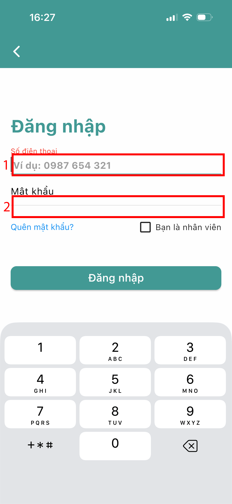
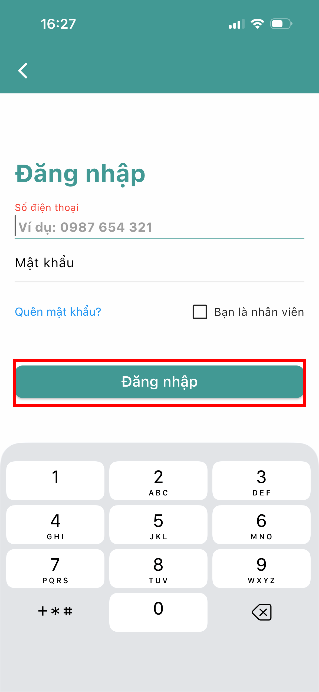

# Đăng nhập

Bước 1: Mở ứng dụng **360Invoice - Quản lý bán hàng**, màn hình giới thiệu sẽ hiện thị ra.

<figure><figcaption></figcaption></figure> <figure><figcaption></figcaption></figure>

Bước 2: Thực hiện nhấn hoặc chọn  nếu đã có tài khoản, hệ thống sẽ chuyển sang màn hình đăng nhập.

<figure><figcaption></figcaption></figure> <figure><figcaption></figcaption></figure>

Bước 3: Nhập đầy đủ thông tin: số điện thoại (số đã đăng ký tài khoản), mật khẩu (mật khẩu tương ứng)

Tùy chọn:&#x20;

* Tick "Bạn là nhân viên" nếu dùng tài khoản nhân viên.
* Nhấn "Quên mật khẩu?" nếu cần lấy lại mật khẩu.

<figure><figcaption></figcaption></figure>

Bước 4: Nhấn nút 

<figure><figcaption></figcaption></figure>

Nếu thông tin chính xác → đăng nhập thành công → hệ thống sẽ chuyển bạn vào màn hình chính của ứng dụng.

