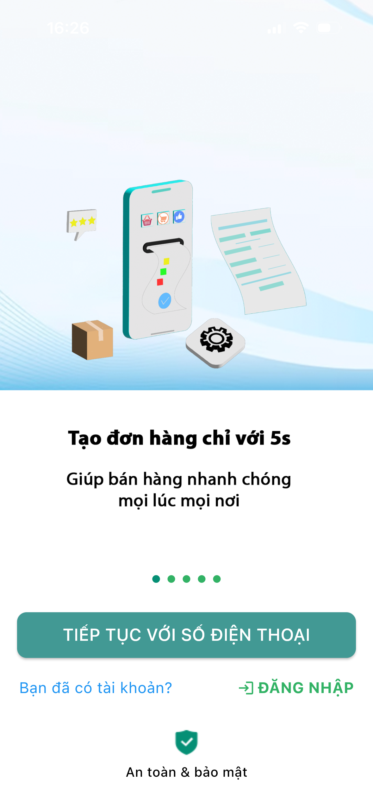
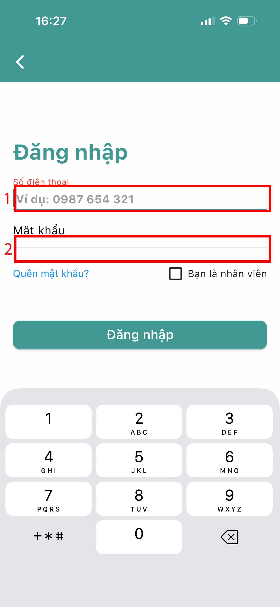
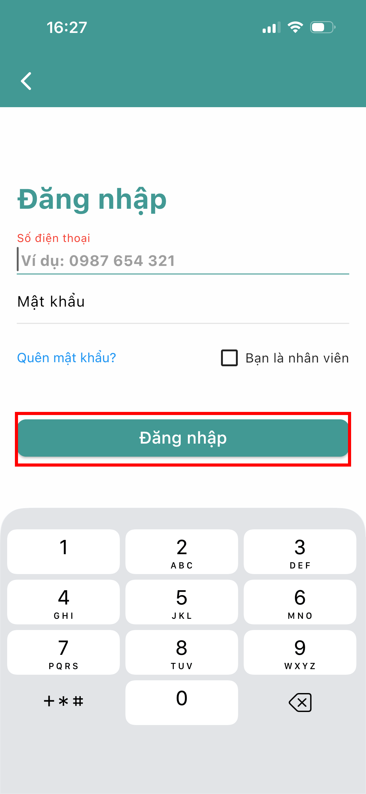

# Đăng nhập

### Bước 1: Mở ứng dụng **360Invoice - Quản lý bán hàng**, màn hình giới thiệu sẽ hiện thị.&#x20;

<figure><figcaption></figcaption></figure> <figure><figcaption></figcaption></figure>

### Bước 2: Nhấn hoặc nhấn  nếu đã có tài khoản, hệ thống sẽ chuyển sang màn hình đăng nhập.

<figure><figcaption></figcaption></figure> <figure><figcaption></figcaption></figure>

### Bước 3: Nhập đầy đủ thông tin yêu cầ

* **Số điện thoại:** Nhập số điện thoại đã đăng ký.
* **Mật khẩu:** Nhập mật khẩu tương ứng.
* T**ùy chọn:**
  * Tích vào ô "**Bạn là nhân viên**" nếu bạn sử dụng tài khoản dành cho nhân viên.
  * Nhấn "Quên mật khẩu?" nếu bạn cần hỗ trợ lấy lại mật khẩu qua số điện thoại.

<figure><figcaption></figcaption></figure>

### Bước 4: Nhấn nút 

<figure><figcaption></figcaption></figure>

Nếu thông tin chính xác, hệ thống sẽ tự động chuyển bạn vào màn hình chính để bắt đầu sử dụng.

