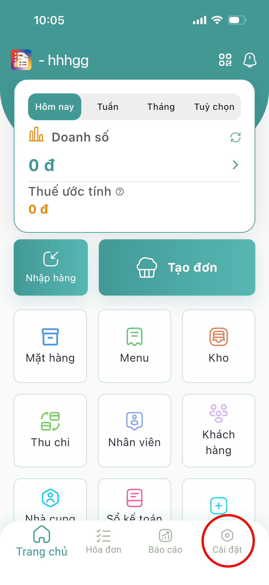

# Đăng xuất

Bước 1: Tại màn hình chính, menu bên dưới nhấn  để chuyển sang màn hình cài đặt:

<figure><figcaption></figcaption></figure>

Bước 2: Nhấn  để đăng xuất tài khoản:

<figure><figcaption></figcaption></figure>
