# Nhà Hàng/Quán

### Bước 1: Thêm menu

#### ➤ Thực hiện:

* Chọn **Menu**
* Chọn **Thêm thực đơn**

<figure>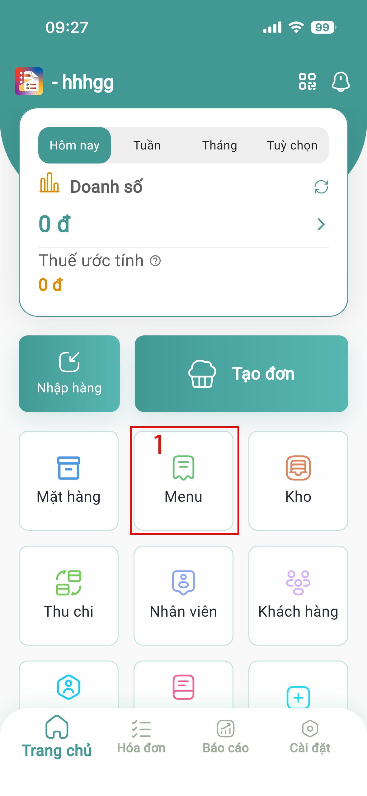<figcaption></figcaption></figure> <figure>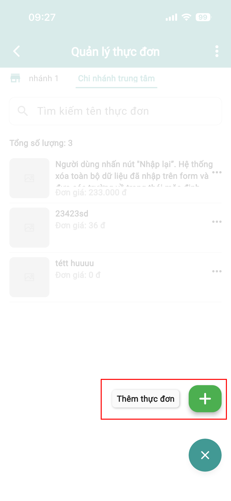<figcaption></figcaption></figure> <figure>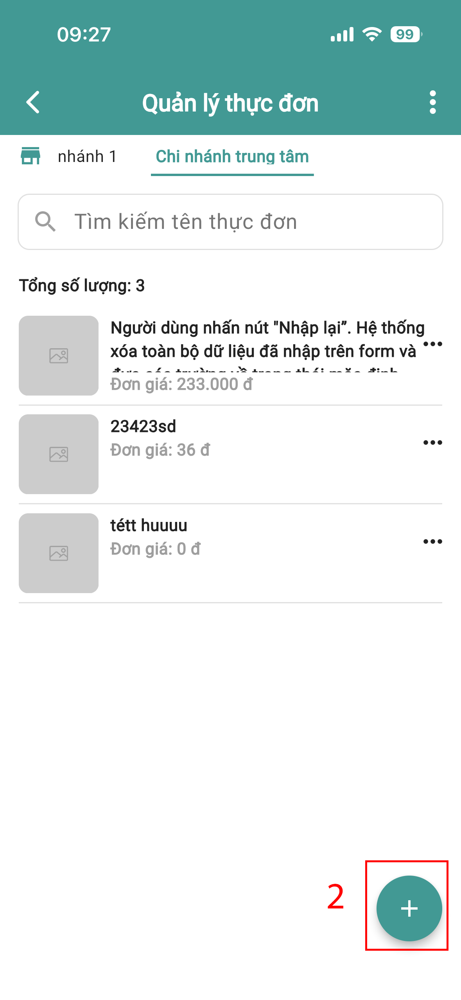<figcaption></figcaption></figure>

#### ➤ Nhập thông tin:

**Thông tin cơ bản:**

* Tên sản phẩm
* Mã sản phẩm
* Ảnh mã vạch _(nếu có)_
* Đơn vị tính
* Giá nhập
* Giá bán lẻ

**Thông tin mở rộng:**

* Giá bán buôn _(nếu có)_
* Nhóm hàng
  * Nhấn **(+)** để tạo nhóm

<figure>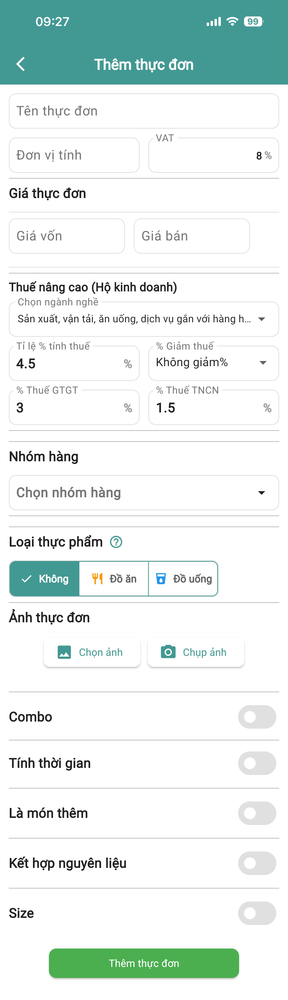<figcaption></figcaption></figure>

#### ➤ Khởi tạo nhóm hàng:

* Chọn **Chọn nhóm hàng**&#x20;
* Nhấn chọn dấu **+**
* Nhập thông tin nhóm hàng
* Nhấn nút **Tạo nhóm hàng hóa**

<figure><figcaption></figcaption></figure> <figure>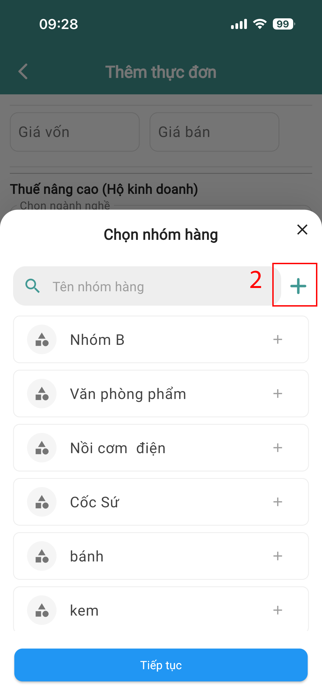<figcaption></figcaption></figure> <figure>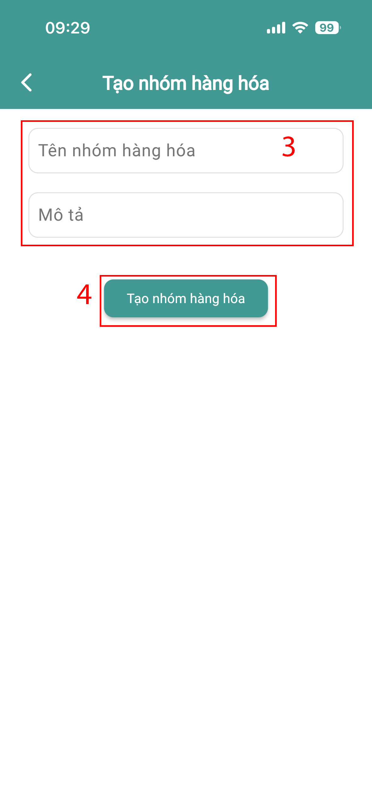<figcaption></figcaption></figure>

### Bước 2: Thêm mặt hàng (nguyên liệu)

#### ➤ Thực hiện:

* Trang chủ → **Mặt hàng**
* Nhấn **(+)** để thêm khu vực
* Chọn **Thêm hàng hóa**
* Nhập đầy đủ thông tin hàng hóa vào

<figure><figcaption></figcaption></figure> <figure>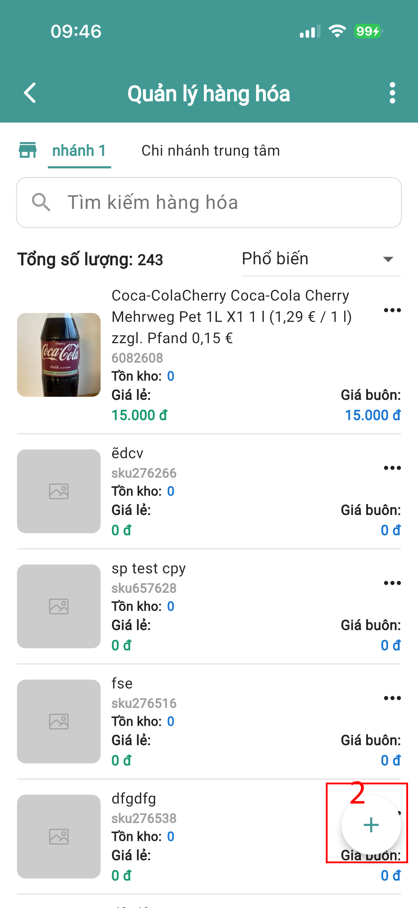<figcaption></figcaption></figure> <figure>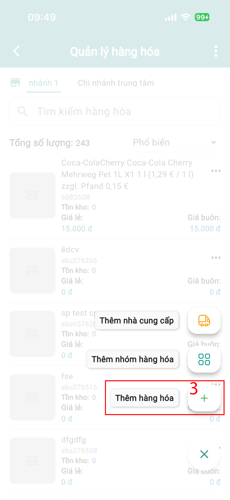<figcaption></figcaption></figure> <figure>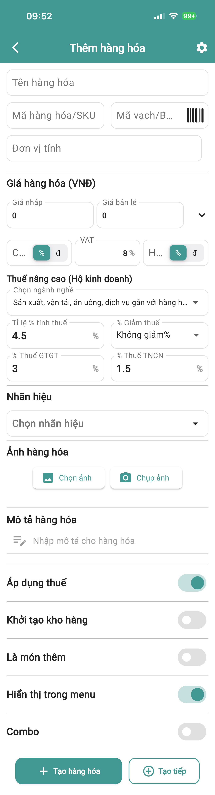<figcaption></figcaption></figure>

#### ➤ Thiết lập:

* Chọn thêm nhẫn hiệu:

<figure><figcaption></figcaption></figure> <figure>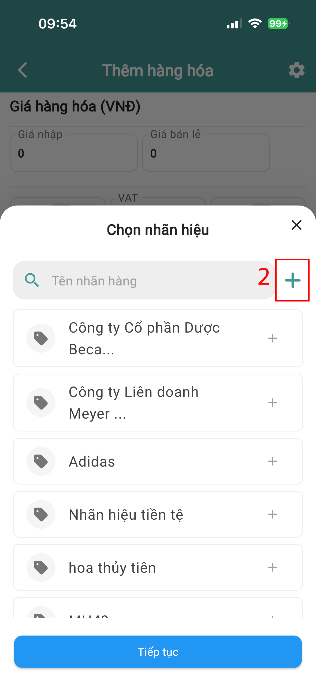<figcaption></figcaption></figure> <figure><figcaption></figcaption></figure>

### Bước 3: Nhập hàng

#### ➤ Thực hiện:

* Trang chủ → **Nhập**
* Chọn **Thêm mới nhà cung cấp**
* Nhập thông tin → Nhấn **Tạo mới**

<figure><figcaption></figcaption></figure> <figure><figcaption></figcaption></figure> <figure><figcaption></figcaption></figure>

#### ➤ Tạo đơn nhập:

* Chọn **Chọn sản phẩm**
* Nhập số lượng

<figure>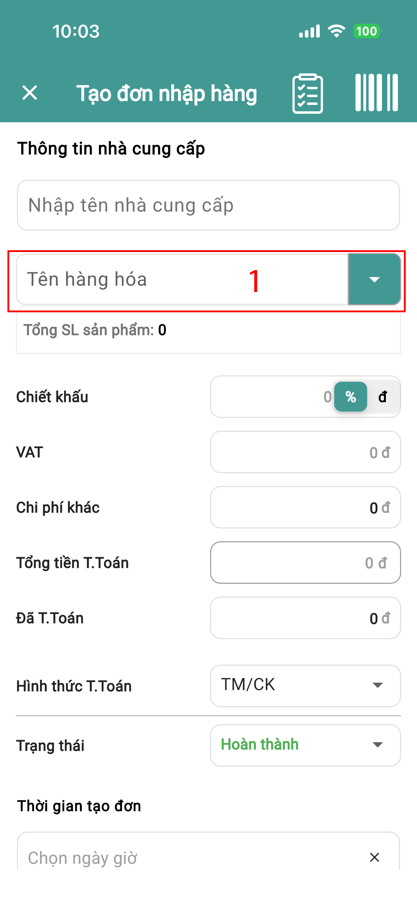<figcaption></figcaption></figure> <figure>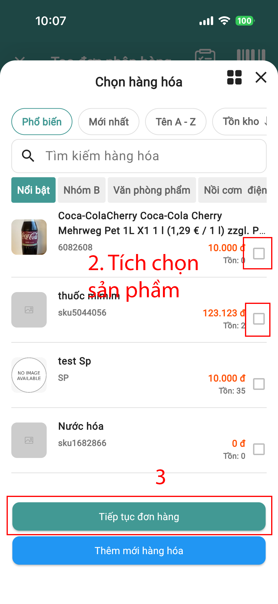<figcaption></figcaption></figure>

#### ➤ Trường hợp đặc biệt:

* Nếu giá nhập thay đổi → nhập giá mới

#### ➤ Thanh toán:

* Chọn hình thức thanh toán

#### ➤ Hoàn tất:

* Nhấn **Tạo đơn**

### Bước 4: Kiểm kho (khi có sai lệch)

#### ➤ Khi sử dụng:

* Khi số lượng thực tế ≠ hệ thống

#### ➤ Thực hiện:

* Trang chủ → **Kho**
* Chọn sản phẩm
* Nhấn **3 chấm** → **Kiểm kho**

<figure><figcaption></figcaption></figure> <figure>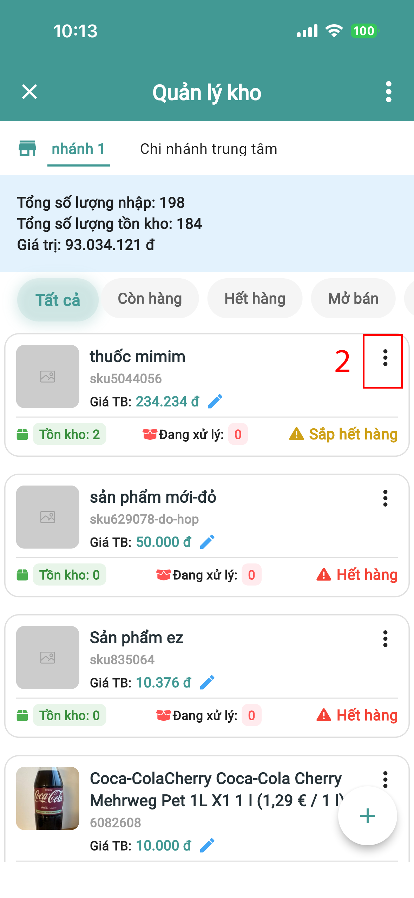<figcaption></figcaption></figure> <figure>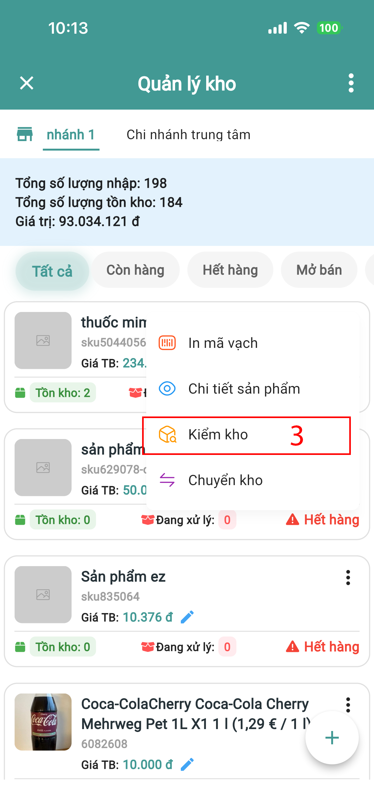<figcaption></figcaption></figure>

#### ➤ Cập nhật:

* Nhập lại số lượng đúng
* Nhấn **Cân bằng kho**

<figure>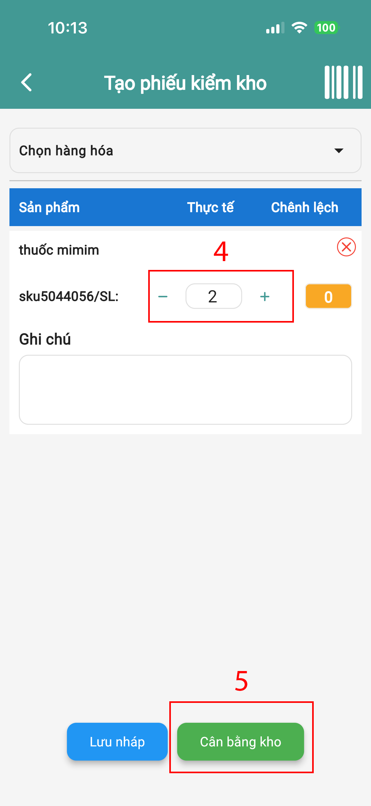<figcaption></figcaption></figure>

### Bước 5: Thêm nguyên liệu cho sản phẩm&#x20;

#### ➤ Thực hiện:

* Trang chủ → **Menu**
* Nhấn **(+)** → **Thêm dịch vụ**

#### ➤ Nhập thông tin:

* Tên món / dịch vụ
* Giá bán
* Nhóm khách hàng

#### ➤ Thiết lập nguyên liệu:

* Bật **Kết hợp nguyên liệu**
* Chọn **Nguyên liệu**
* Nhấn **Tiếp tục**
* Nhập số lượng theo tỉ lệ

### Bước 6: Bán hàng

#### ➤ Thực hiện:

* Trang chủ → **Phòng**
* Chọn khu vực → Chọn phòng/bàn

#### ➤ Tạo đơn:

* Chọn **Khách hàng**
* Chọn **Mặt hàng / Dịch vụ**

#### ➤ Thanh toán:

**Trường hợp 1: Thanh toán ngay**

* Nhấn **Thanh toán**

**Trường hợp 2: Thanh toán sau**

* Chọn **Tùy chọn** → **Tạo đơn**

👉 Khi khách thanh toán:

* Mở lại phòng
* Nhấn **Thanh toán**

**Hướng dẫn chi tiết tại:** [**https://youtu.be/xmxJJBKzMtw?si=eKxchpuqa7ikrHpx**](https://youtu.be/xmxJJBKzMtw?si=eKxchpuqa7ikrHpx)

## Lưu ý quan trọng

* Kiểm tra tồn kho trước khi bán
* Nhập đúng giá nhập để đảm bảo lợi nhuận
* Thiết lập nguyên liệu chính xác để trừ kho đúng
* Kiểm kho định kỳ để tránh sai lệch
