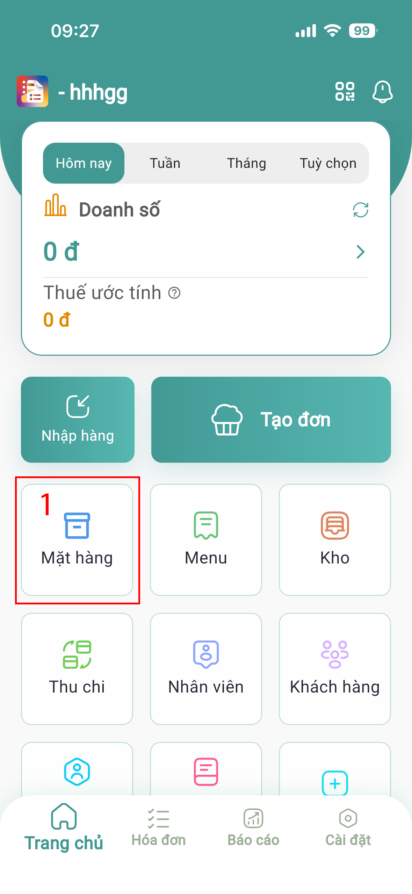
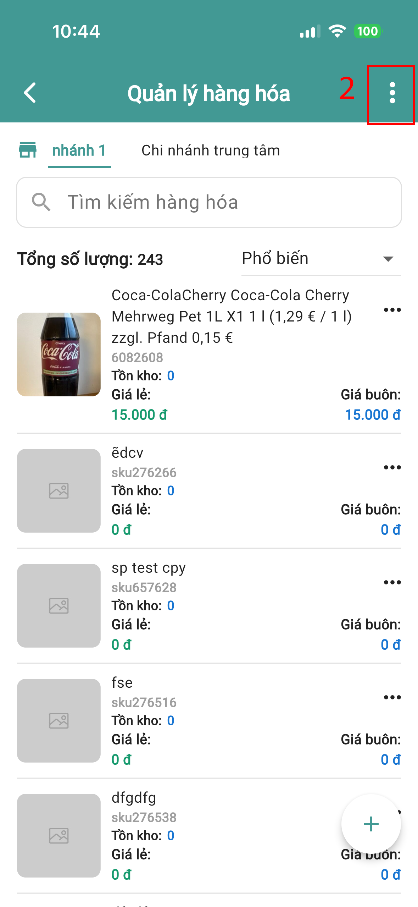
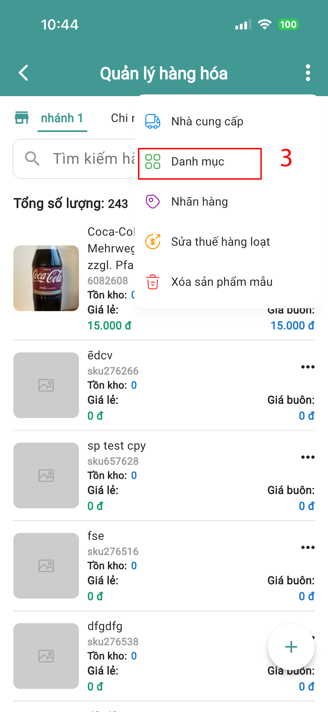
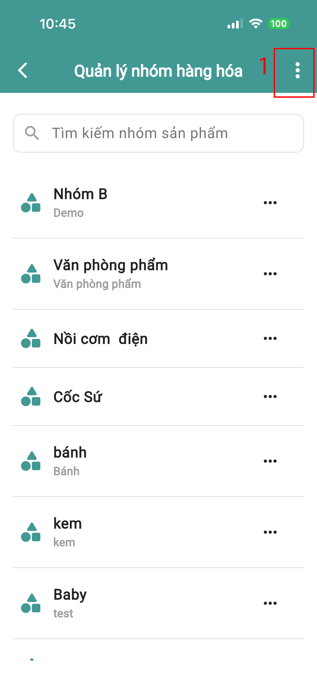
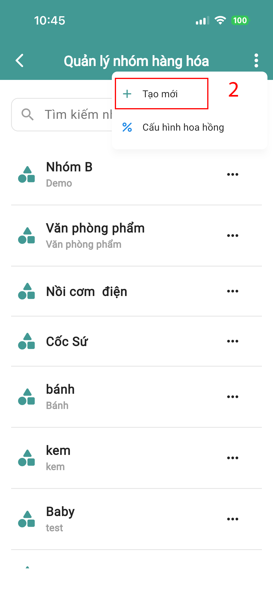
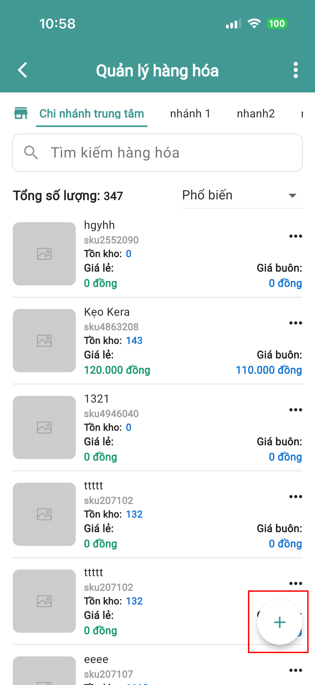
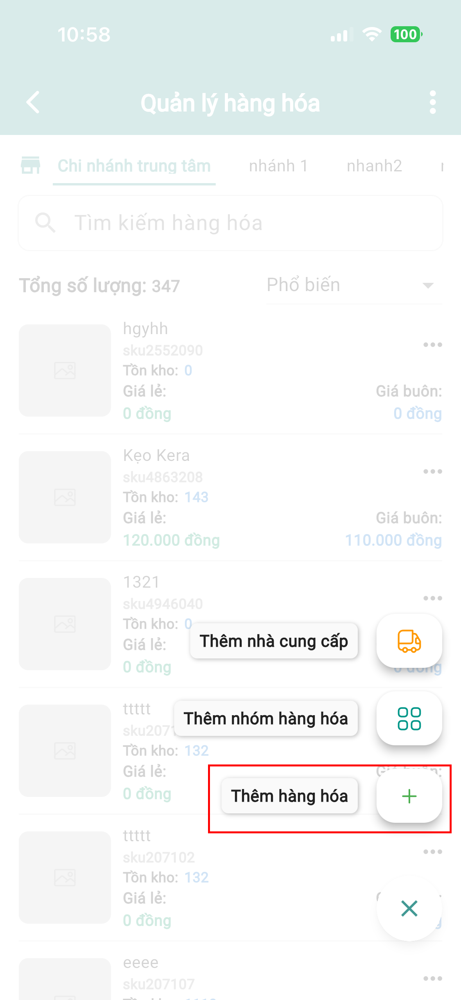
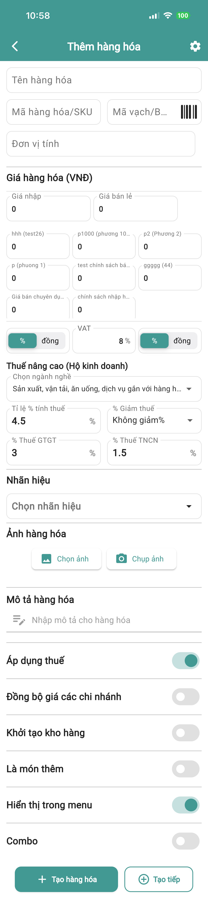
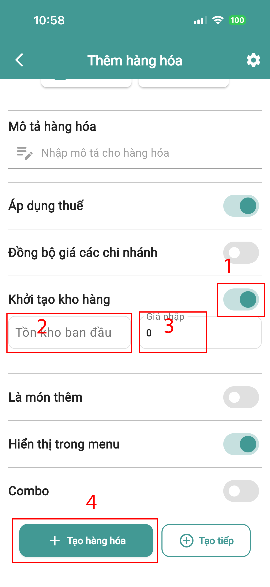
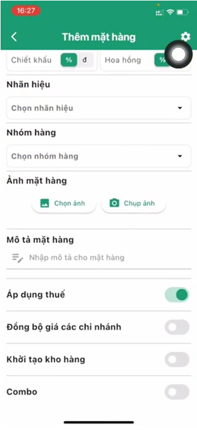

# Spa - Salon - Massage - Làm đẹp

### Bước 1: Tạo nhóm sản phẩm (Sản phẩm / Dịch vụ)

#### ➤ Thực hiện:

* Trang chủ → **Hàng hóa**
* Nhấn **3 chấm** (góc phải trên)
* Chọn **Danh mục**

<figure><figcaption></figcaption></figure> <figure><figcaption></figcaption></figure> <figure><figcaption></figcaption></figure>

#### ➤ Tạo nhóm:

* Nhấn **3 chấm** (góc phải trên)
* Chọn **Tạo mới**
* Nhập **tên nhóm**
* Nhấn **Tạo nhóm mặt hàng**

<figure><figcaption></figcaption></figure> <figure><figcaption></figcaption></figure> <figure><figcaption></figcaption></figure>

### Bước 2: Thêm sản phẩm

#### ➤ 2.1 Sản phẩm vật lý

**Áp dụng:** Hàng hóa có tồn kho

#### Thực hiện:

* Trang chủ → **Hàng hóa**
* Nhấn **(+)** → **Thêm mặt hàng**

<figure><figcaption></figcaption></figure> <figure><figcaption></figcaption></figure> <figure><figcaption></figcaption></figure>

#### Nhập thông tin:

* Tên mặt hàng
* Giá bán lẻ
* Giá nhập

<figure><figcaption></figcaption></figure>

#### Khởi tạo kho:

* Bật **Khởi tạo kho hàng**
* Nhập **tồn kho ban đầu**

<figure><figcaption></figcaption></figure>

#### Hoàn tất:

* Nhấn **Tạo mặt hàng**

#### ➤ 2.2 Sản phẩm dịch vụ

**Áp dụng:** Dịch vụ không quản lý tồn kho

#### Thực hiện:

* Trang chủ → **Hàng hóa**
* Nhấn **(+)** → **Thêm mặt hàng**

<figure><figcaption></figcaption></figure> <figure><figcaption></figcaption></figure> <figure><figcaption></figcaption></figure>

#### Nhập thông tin:

* Tên mặt hàng
* Giá bán

⚠️ Lưu ý:

* Không cần nhập giá nhập
* Không cần tồn kho

#### Thiết lập:

* Chọn **Nhóm hàng: Dịch vụ**

<figure><figcaption></figcaption></figure> <figure><figcaption></figcaption></figure>

#### Hoàn tất:

* Nhấn **Tạo mặt hàng**

### Bước 3: Nhập hàng

#### ➤ Thực hiện:

* Trang chủ → **Nhập**
* Chọn **Thêm mới nhà cung cấp**
* Nhập thông tin → Nhấn **Tạo mới**

#### ➤ Tạo đơn nhập:

* Chọn **Chọn sản phẩm**
* Nhập số lượng

#### ➤ Trường hợp đặc biệt:

* Nếu giá nhập thay đổi → nhập giá mới

#### ➤ Thanh toán:

* Chọn hình thức thanh toán

#### ➤ Hoàn tất:

* Nhấn **Tạo đơn**

### Bước 4: Bán hàng

#### ➤ Thực hiện:

* Trang chủ → **Bán hàng**

#### ➤ Tính năng hỗ trợ:

* Quét mã vạch → Nhấn **3 chấm**
* Tạo đơn bằng giọng nói → Nhấn **micro**

#### ➤ Chọn khách hàng:

**Khách lẻ:**

* Tích **Khách lẻ**
* Nhập tên

**Khách hàng có sẵn:**

* Chọn khách hàng
* Hoặc nhấn **Tạo mới**

#### ➤ Tạo đơn:

* Thêm sản phẩm
* Nhập **chiết khấu** (nếu có):
  * Theo %
  * Hoặc số tiền

#### ➤ Thanh toán:

* Chọn hình thức thanh toán

#### ➤ Hoàn tất:

* Nhấn **Tạo đơn**

**Hướng dãn xem chi tiết tại:** [**https://youtu.be/YV0sjBhJbpE?si=xJIPrGrk5mXgfPUD**](https://youtu.be/YV0sjBhJbpE?si=xJIPrGrk5mXgfPUD)

## Lưu ý quan trọng

* Phân biệt rõ:
  * **Sản phẩm vật lý** → có tồn kho
  * **Dịch vụ** → không tồn kho
* Kiểm tra giá nhập trước khi tạo đơn nhập
* Kiểm tra tồn kho trước khi bán
