# Tạp hóa - Siêu thị - Đại lý

### Bước 1: Thêm sản phẩm

Cách thực hiện

#### ➤ Truy cập:

* Chọn **Sản phẩm**
*

    <figure><figcaption></figcaption></figure>

#### ➤ Trường hợp 1: Đã có file sản phẩm

* Chọn **Upload file Excel**
* Tải file lên hệ thống

#### ➤ Trường hợp 2: Chưa có file

* Chọn **Thêm sản phẩm**
* Nhập các thông tin:

<figure>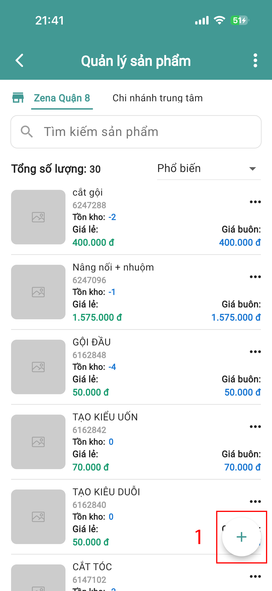<figcaption></figcaption></figure> <figure>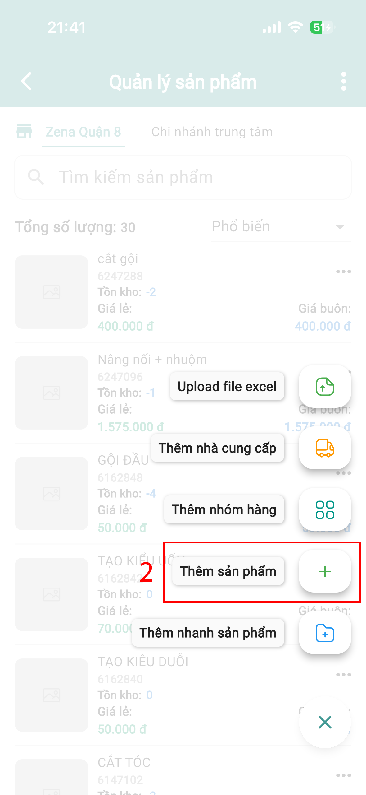<figcaption></figcaption></figure>

**Thông tin bắt buộc:**

* Tên sản phẩm
* Mã sản phẩm
* Ảnh mã vạch
* Đơn vị tính
* Giá nhập
* Giá bán lẻ

**Thông tin mở rộng (nếu có):**

* Giá bán buôn
* Nhóm hàng
  * Nhấn **(+)** để tạo nhóm mới

<figure>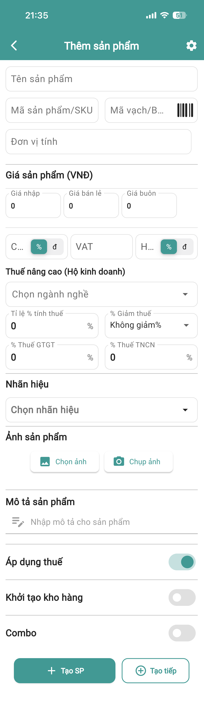<figcaption></figcaption></figure>

#### ➤ Thiết lập thêm:

* Bật tính năng **Quản lý lô – Hạn sử dụng (HSD)** nếu cần

### Bước 2: Nhập hàng

Cách thực hiện

#### ➤ Truy cập:

* Trang chủ → Chọn **Nhập**

<figure><figcaption></figcaption></figure>

#### ➤ Tạo nhà cung cấp:

* Chọn **Thêm mới nhà cung cấp**

<figure>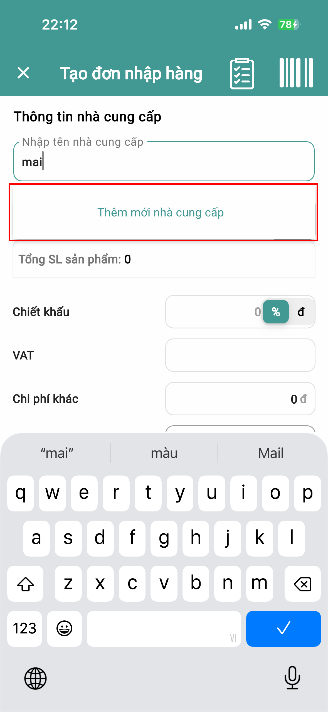<figcaption></figcaption></figure>

* Nhập thông tin cần thiết

<figure>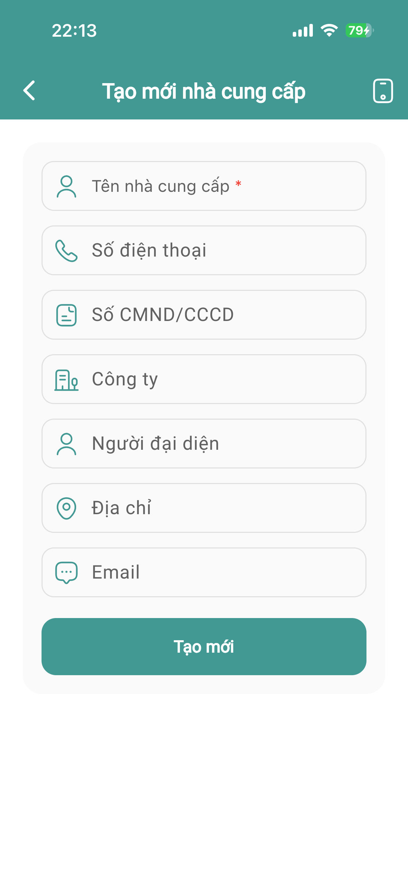<figcaption></figcaption></figure>

* Chọn **Tạo mới**

#### ➤ Tạo đơn nhập:

* Chọn **Chọn sản phẩm**
* Nhập số lượng

#### ➤ Nếu có quản lý lô:

* Chọn **Tạo lô mới**
* Nhập:
  * Mã lô
  * Số lượng
  * NSX (Ngày sản xuất)
  * HSD (Hạn sử dụng)

👉 Hệ thống sẽ tự cập nhật số lượng

#### ➤ Thông tin bổ sung:

* Nhập **giá nhập mới** (nếu thay đổi)
* Chọn **thời gian tạo đơn**
* Chọn **hình thức thanh toán**

<figure><figcaption></figcaption></figure>

#### ➤ Hoàn tất:

* Nhấn **Tạo đơn**

### Bước 3: Kiểm kho / Cân bằng kho

### Khi nào dùng?

👉 Khi số lượng thực tế ≠ số lượng trên hệ thống

#### ➤ Thực hiện:

* Trang chủ → Chọn **Kho**

<figure><figcaption></figcaption></figure>

* Chọn sản phẩm cần kiểm

<figure>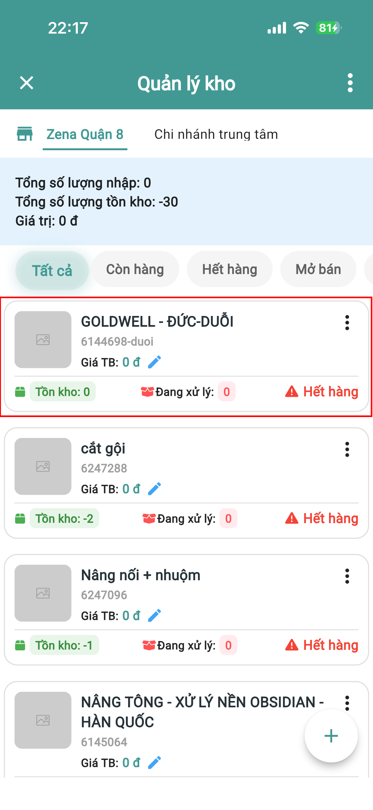<figcaption></figcaption></figure>

#### ➤ Thao tác:

* Nhấn **3 chấm**

<figure><figcaption></figcaption></figure>

* Chọn **Kiểm kho**

<figure>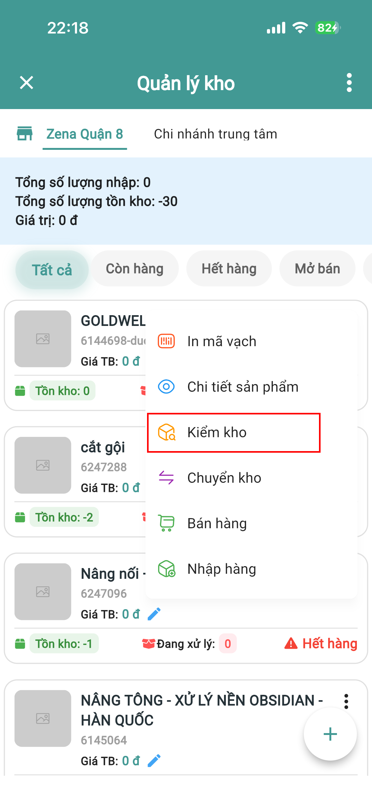<figcaption></figcaption></figure>

* Nhập lại số lượng đúng thực tế

<figure>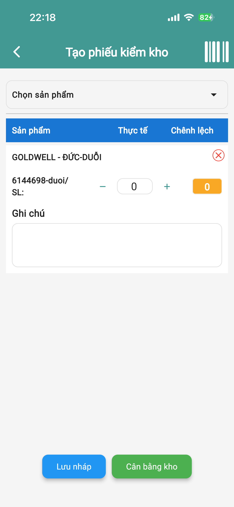<figcaption></figcaption></figure>

#### ➤ Hoàn tất:

* Nhấn **Cân bằng kho**

### Bước 4: Bán hàng

Cách thực hiện

#### ➤ Truy cập:

* Trang chủ → Chọn **Bán hàng**

<figure><figcaption></figcaption></figure>

#### ➤ Tính năng hỗ trợ:

* Quét mã vạch → Nhấn **3 chấm**

<figure>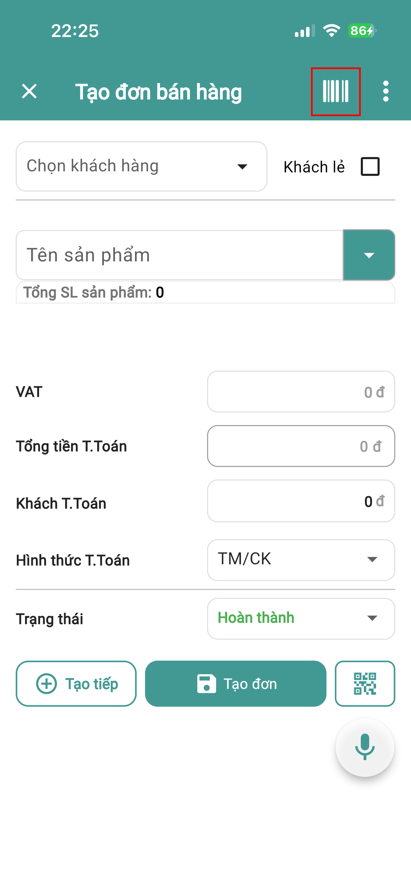<figcaption></figcaption></figure>

* Tạo đơn bằng giọng nói → Nhấn **micro**

<figure><figcaption></figcaption></figure>

#### ➤ Chọn khách hàng:

**Khách lẻ:**

* Tích chọn **Khách lẻ**
* Nhập tên khách

<figure>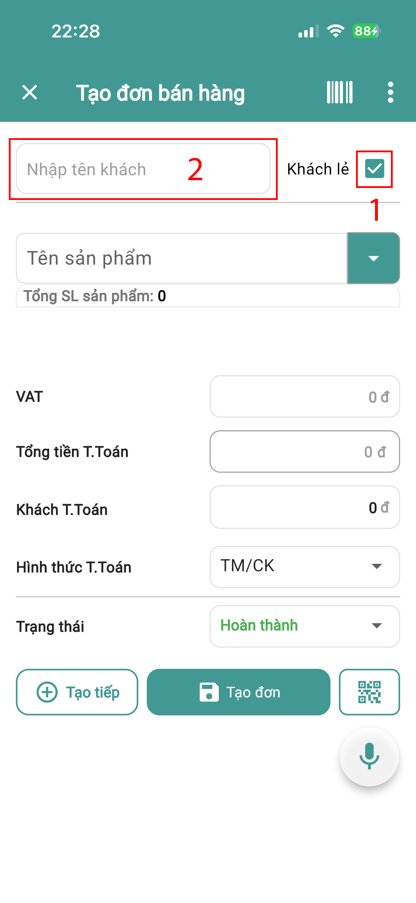<figcaption></figcaption></figure>

**Khách bán buôn:**

* Chọn khách hàng có sẵn
* Hoặc nhấn **Tạo mới**

<figure>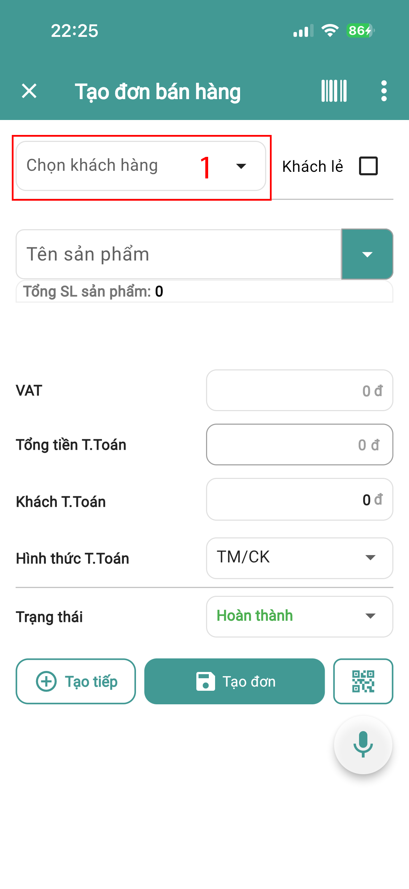<figcaption></figcaption></figure> <figure>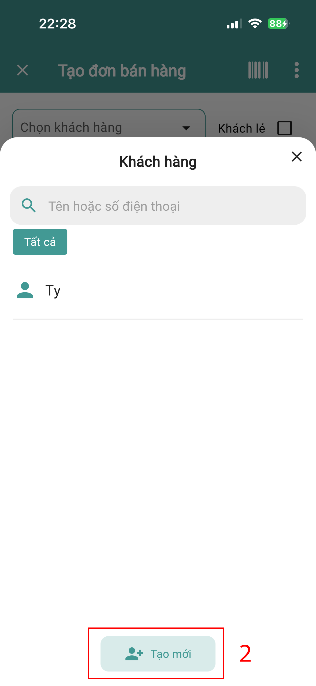<figcaption></figcaption></figure> <figure>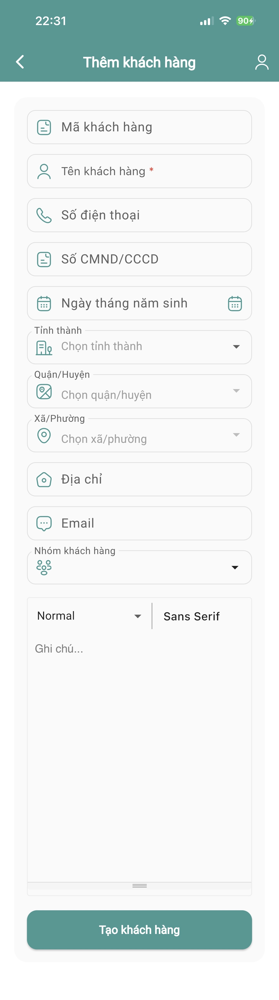<figcaption></figcaption></figure>

#### ➤ Tạo đơn:

* Chọn **Thêm sản phẩm**
* Nhập **chiết khấu** (nếu có):
  * Theo %
  * Hoặc số tiền

#### ➤ Thanh toán:

* Chọn **hình thức thanh toán**

#### ➤ Hoàn tất:

* Nhấn **Tạo đơn**

**Hướng dẫn chi tiết xem tại:** [**https://youtu.be/G45c4wvjEPs?si=Nc7kkQSyKFL1W258**](https://youtu.be/G45c4wvjEPs?si=Nc7kkQSyKFL1W258)
