# Tạp hóa - Siêu thị - Đại lý

### 1. Thêm sản phẩm mới

* Chọn Sản phẩm -> Nhấn dấu (+).

<figure><figcaption></figcaption></figure> <figure><figcaption></figcaption></figure> <figure>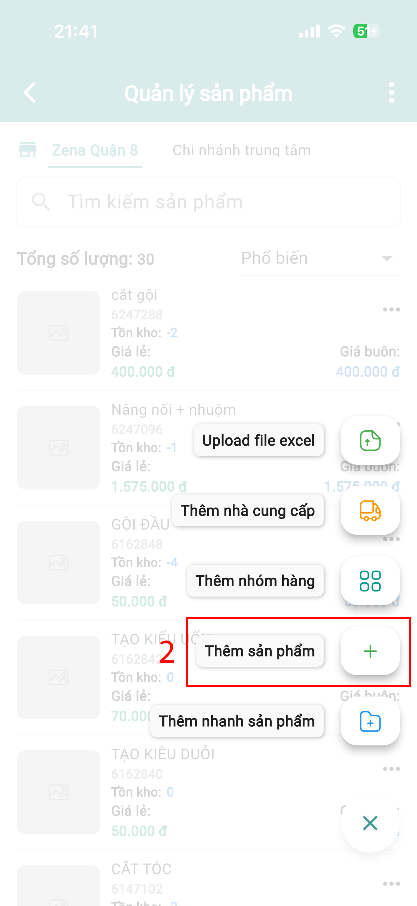<figcaption></figcaption></figure> <figure>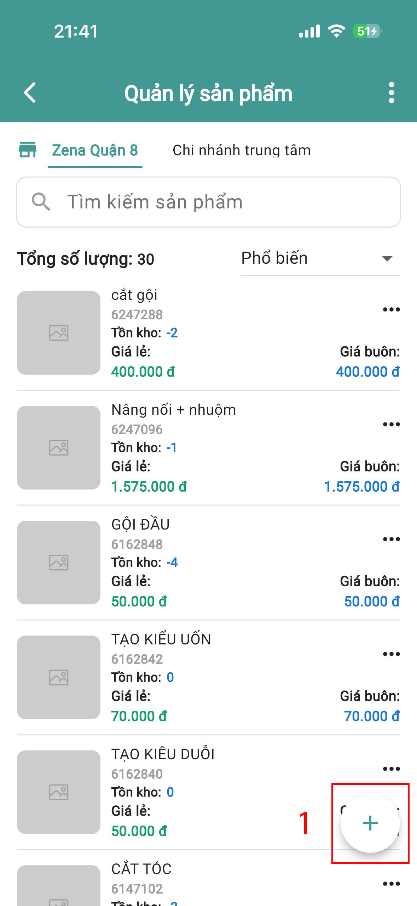<figcaption></figcaption></figure>

* Nhập Tên sản phẩm (VD: Nước ngọt). Bạn có thể bấm vào biểu tượng mã vạch để quét và lưu mã vạch của sản phẩm.
* Điền Đơn vị tính (VD: Chai), Giá nhập và Giá bán lẻ (Nếu có giá buôn thì điền thêm, không có thì bỏ qua).
* Chọn Nhóm hàng: Nhấn vào dấu (**+**) để tạo nhóm mới (VD: Nước) -> **Tạo nhóm sản phẩm**.
* Quản lý kho: Bật tính năng Khởi tạo kho hàng và điền số lượng hiện tại (nếu có sẵn trong kho).

<figure>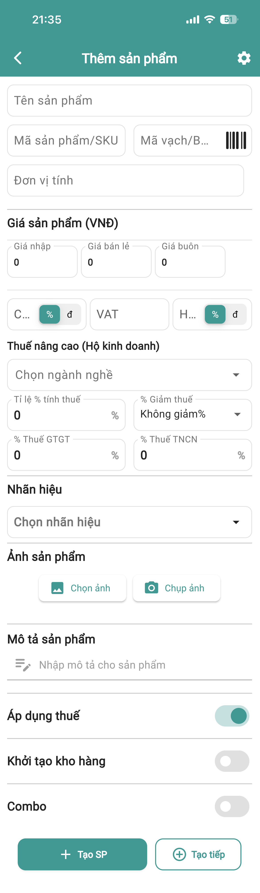<figcaption></figcaption></figure>

* Nhấn **Tạo sản phẩm** để hoàn tất.

### 2. Nhập hàng (Nhập kho)

* Từ trang chủ, chọn **Nhập**.

<figure><figcaption></figcaption></figure>

* Thêm/Chọn Nhà cung cấp: Điền tên, số điện thoại -> Tạo mới (Có thể điền thêm địa chỉ/công ty nếu cần).

<figure>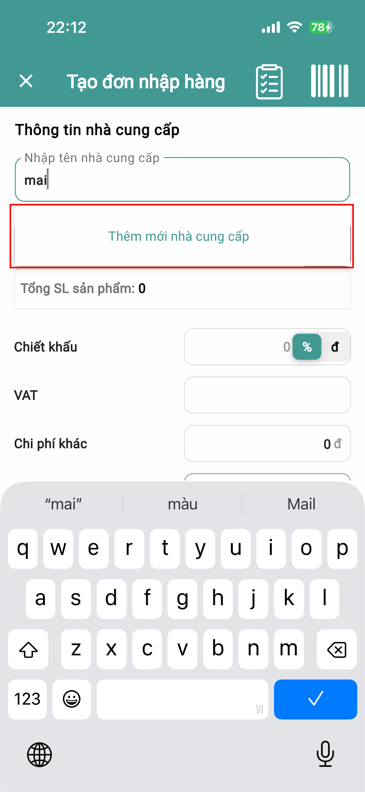<figcaption></figcaption></figure> <figure>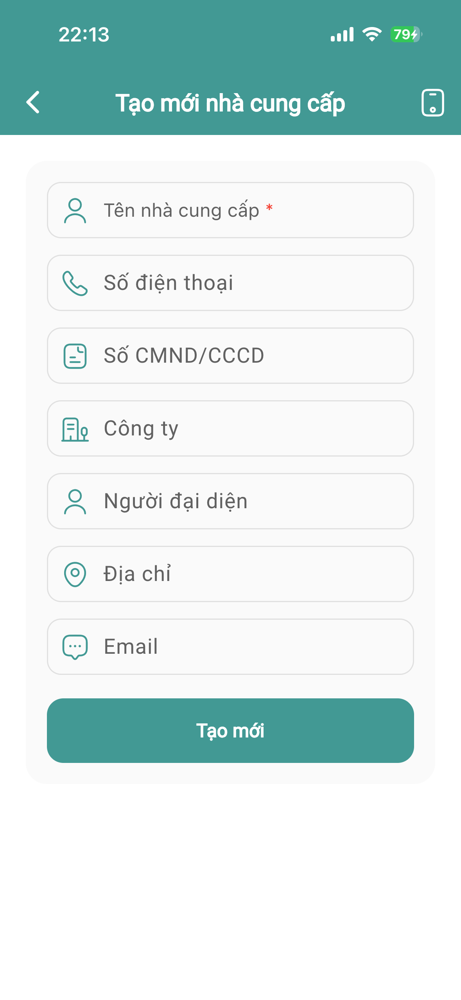<figcaption></figcaption></figure>

* Chọn sản phẩm cần nhập -> Nhấn Tiếp tục đơn hàng.

<figure><figcaption></figcaption></figure> <figure><figcaption></figcaption></figure>

* Điền số lượng nhập (VD: 50 chai). Hệ thống sẽ tự tính giá tiền. Bạn có thể thêm Thuế VAT, Chiết khấu (VD: giảm 5% hoặc giảm 50.000đ).

<figure><figcaption></figcaption></figure>

* Tùy chỉnh Ngày/Giờ nhập hàng nếu bạn đang nhập lại phiếu từ hôm qua. Nhấn Đồng ý.

<figure><figcaption></figcaption></figure> <figure><figcaption></figcaption></figure>

* Nhấn **Tạo đơn**.
* _Lưu ý: Để xem lại/xóa hoặc quản lý phiếu nhập, bạn vào mục Nhập hàng, nhấn vào biểu tượng danh sách (bảng) để xem, có thể vuốt trái để xóa đơn._

#### 3. Bán hàng

* Chọn Bán hàng.

<figure><figcaption></figcaption></figure>

* Điền thông tin khách hàng hoặc tích chọn Khách lẻ.

<figure>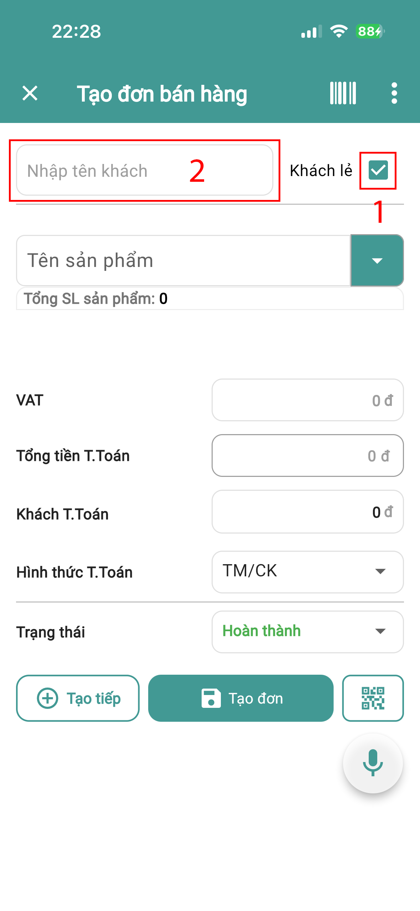<figcaption></figcaption></figure>

*

    
<figure>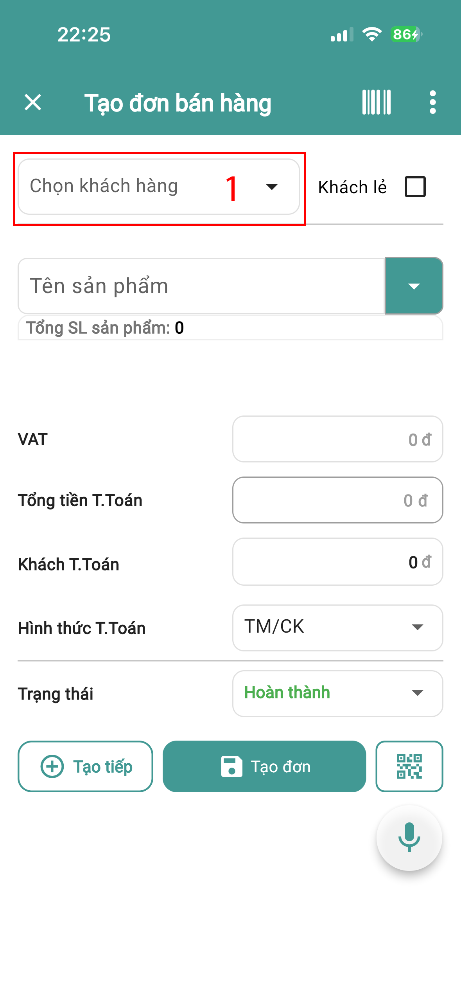<figcaption></figcaption></figure> <figure>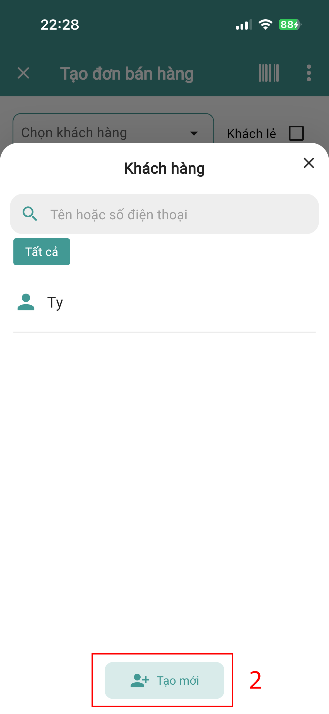<figcaption></figcaption></figure> <figure>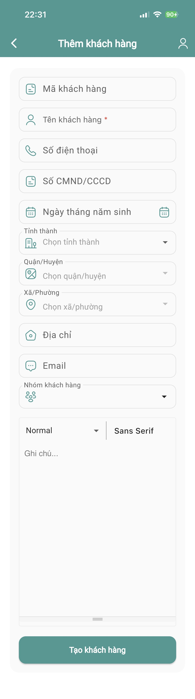<figcaption></figcaption></figure>

* Chọn sản phẩm (VD: Nước ngọt, Xúc xích...) hoặc nhấn vào biểu tượng Quét mã vạch để camera tự nhận diện.

<figure><figcaption></figcaption></figure> <figure><figcaption></figcaption></figure>

* Nhấn Tiếp tục đơn hàng -> Điền số lượng muốn bán.

<figure><figcaption></figcaption></figure>

* Chọn hình thức thanh toán (Tiền mặt, Quẹt thẻ...).

<figure><figcaption></figcaption></figure>

* Nhấn **Tạo đơn**. Bạn có thể chọn In hóa đơn nếu khách có nhu cầu.

#### 4. Quản lý Đơn bán và Trả hàng

* Tại mục Bán hàng, nhấn vào dấu Ba chấm (...) -> Chọn Danh sách đơn hàng (Quản lý đơn bán).

<figure><figcaption></figcaption></figure> <figure><figcaption></figcaption></figure>

* Xóa đơn: Vuốt đơn hàng sang bên trái -> Chọn Xóa.

<figure><figcaption></figcaption></figure> <figure><figcaption></figcaption></figure>

* Sửa đơn: Nhấn vào biểu tượng "**ba gạch**" trên đơn hàng -> **Sửa đơn** (VD: sửa số lượng từ 2 chai thành 1 chai) -> **Cập nhật**.

<figure><figcaption></figcaption></figure> <figure><figcaption></figcaption></figure> <figure><figcaption></figcaption></figure>

* Khách trả hàng: Nhấn vào dấu Ba chấm (...) trên đơn hàng -> Chọn Trả hàng -> Điền số lượng khách trả -> Xác nhận trả hàng.

<figure><figcaption></figcaption></figure> <figure><figcaption></figcaption></figure> <figure><figcaption></figcaption></figure>

#### 5. Kiểm kho và Cân bằng kho

* Chọn mục **Kho** từ trang chủ.

<figure><figcaption></figcaption></figure>

* Nhấn vào dấu Ba chấm (...) của sản phẩm có số lượng chênh lệch thực tế -> Chọn Kiểm kho.

<figure>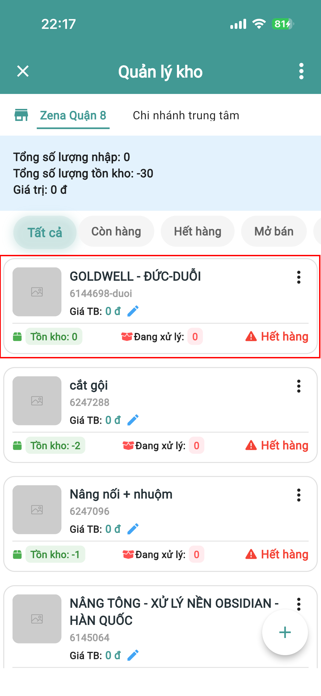<figcaption></figcaption></figure> <figure><figcaption></figcaption></figure> <figure>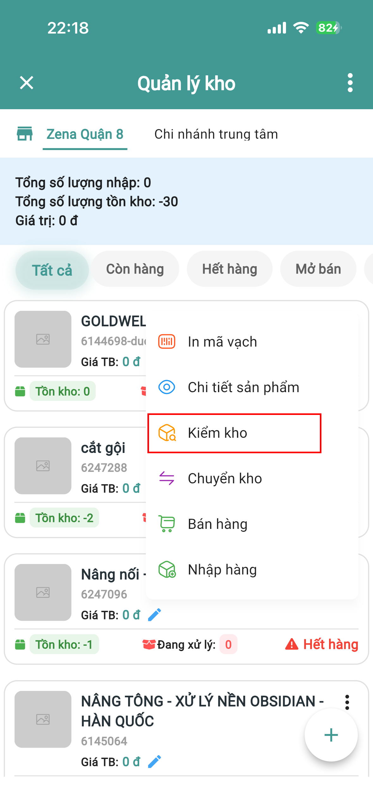<figcaption></figcaption></figure>

* Nhập số lượng thực tế đếm được.

<figure>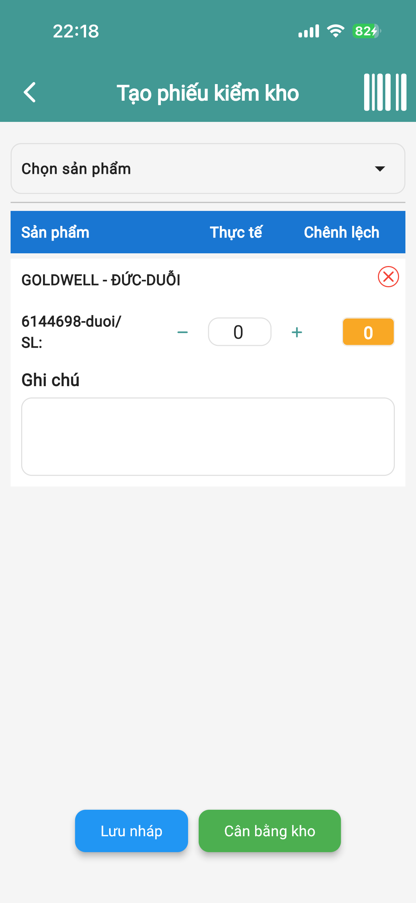<figcaption></figcaption></figure>

* Nhấn **Cân bằng kho**, hệ thống sẽ tự động cập nhật và tạo ra một phiếu kiểm/nhập kho cho số lượng chênh lệch đó.

**Hướng dẫn chi tiết xem tại:** [**https://youtu.be/G45c4wvjEPs?si=Nc7kkQSyKFL1W258**](https://youtu.be/G45c4wvjEPs?si=Nc7kkQSyKFL1W258)
