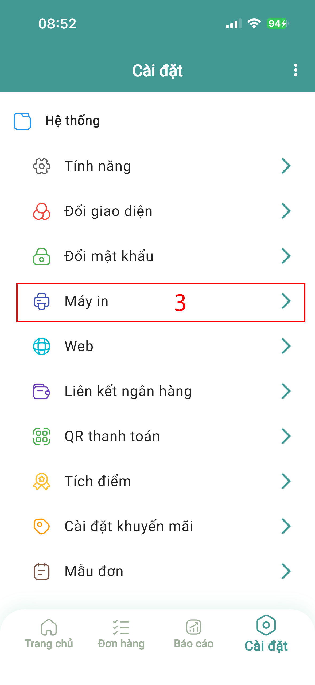
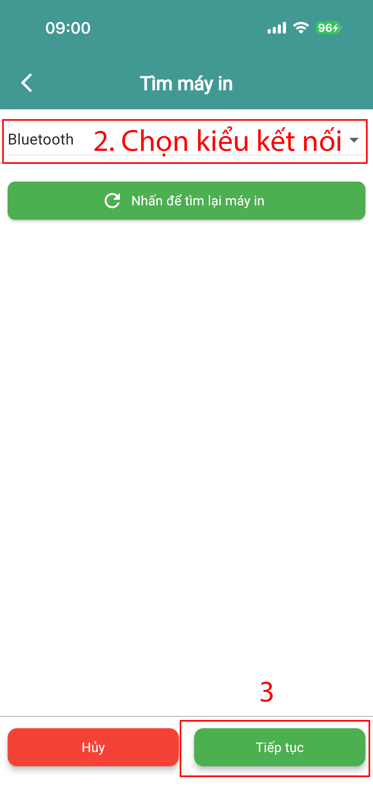

# Thời trang - Giày dép - làm đẹp

### Bước 1: Thêm sản phẩm

#### ➤ Truy cập:

* Chọn **Sản phẩm**

<figure><figcaption></figcaption></figure>

#### ➤ Trường hợp 1: Đã có file sản phẩm

* Chọn **Upload file Excel**
* Tải file lên hệ thống

<figure><figcaption></figcaption></figure>

#### ➤ Trường hợp 2: Chưa có file

* Chọn **Thêm sản phẩm**

<figure><figcaption></figcaption></figure> <figure><figcaption></figcaption></figure>

* Nhập thông tin:

<figure><figcaption></figcaption></figure>

**Thông tin chính:**

* Tên sản phẩm
* Mã sản phẩm
* Ảnh mã vạch _(nếu có)_
* Đơn vị tính
* Giá nhập
* Giá bán lẻ

**Thông tin mở rộng:**

* Giá bán buôn _(nếu có)_
* Nhóm hàng
  * Nhấn **(+)** để tạo nhóm

#### ➤ Khởi tạo tồn kho:

* Bật **Khởi tạo kho hàng**
* Nhập **số lượng sản phẩm hiện có**

### Bước 2: Tích hợp máy in

#### ➤ Truy cập:

* Trang chủ → **Cài đặt** → **Hệ thống** → **Máy in**

<figure><figcaption></figcaption></figure> <figure><figcaption></figcaption></figure> <figure><figcaption></figcaption></figure>

#### ➤ Cài đặt:

* Chọn **Thêm máy in**
* Chọn kiểu kết nối:
  * Bluetooth
  * WiFi
  * USB

<figure><figcaption></figcaption></figure> <figure><figcaption></figcaption></figure>

#### ➤ Xác nhận:

* Cho phép **chia sẻ mạng cục bộ**
* Nhấn **Tiếp tục**

### Bước 3: In tem sản phẩm

#### ➤ Trường hợp: Sản phẩm chưa có mã vạch

#### ➤ Thực hiện:

* Vào **Mở rộng**
* Chọn **In mã vạch**
* Chọn sản phẩm cần in

<figure><figcaption></figcaption></figure> <figure><figcaption></figcaption></figure>

#### ➤ In:

* Nhấn biểu tượng **máy in** (góc phải trên)
* Chọn **In mã vạch**

<figure><figcaption></figcaption></figure> <figure><figcaption></figcaption></figure>

### Bước 4: Thêm nhà cung cấp

#### ➤ Truy cập:

* Trang chủ → Chọn **Nhập**

<figure><figcaption></figcaption></figure>

#### ➤ Thực hiện:

* Chọn **Thêm mới nhà cung cấp**
* Nhập thông tin cần thiết
* Lưu lại

<figure><figcaption></figcaption></figure> <figure><figcaption></figcaption></figure>

### Bước 5: Nhập hàng

#### ➤ Truy cập:

* Trang chủ → **Nhập**

#### ➤ Tạo đơn:

* Chọn **Tạo mới**
* Chọn **Chọn sản phẩm**
* Nhập số lượng

#### ➤ Trường hợp đặc biệt:

* Nếu **giá nhập thay đổi** → nhập giá mới

#### ➤ Thanh toán:

* Chọn **hình thức thanh toán**

#### ➤ Hoàn tất:

* Nhấn **Tạo đơn**

### Bước 6: Bán hàng

#### ➤ Truy cập:

* Trang chủ → **Bán hàng**

#### ➤ Tính năng hỗ trợ:

* Quét mã vạch → Nhấn **3 chấm**
* Tạo đơn bằng giọng nói → Nhấn **micro**

#### ➤ Chọn khách hàng:

**Khách lẻ:**

* Tích **Khách lẻ**
* Nhập tên

**Khách bán buôn:**

* Chọn khách hàng
* Hoặc **Tạo mới**

#### ➤ Tạo đơn:

* Thêm sản phẩm
* Nhập **chiết khấu** (nếu có):
  * % hoặc số tiền

#### ➤ Thanh toán:

* Chọn hình thức thanh toán

#### ➤ Hoàn tất:

* Nhấn **Tạo đơn**

Hướng dẫn chi tiết xem tại: [https://youtu.be/RsVKp9Vdz-k?si=wLR5vqvxa5DFLJ37](https://youtu.be/RsVKp9Vdz-k?si=wLR5vqvxa5DFLJ37)
