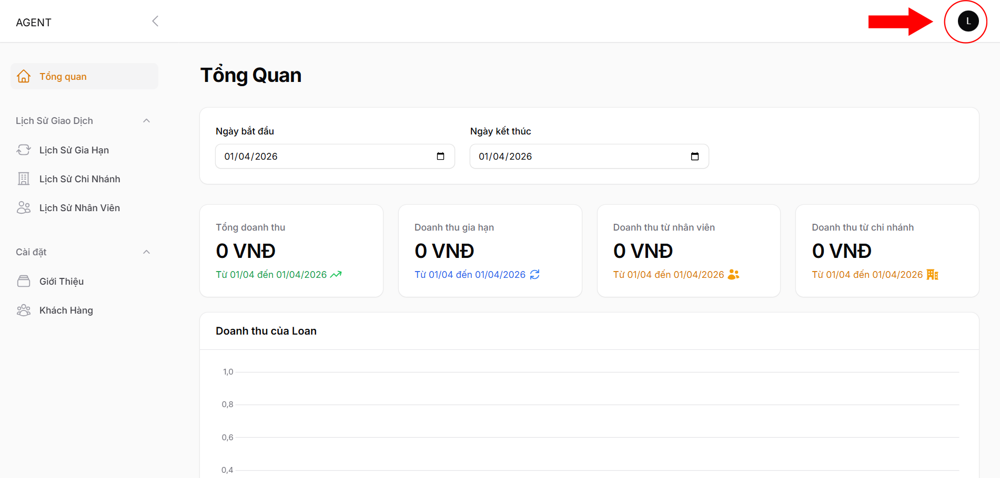
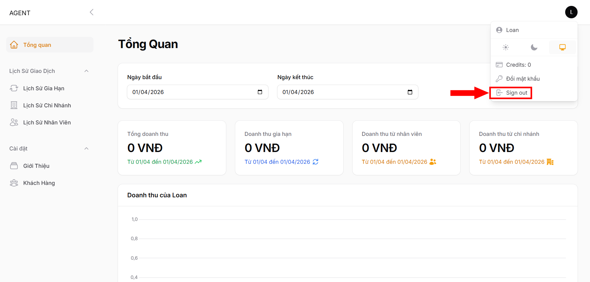

# Đăng xuất trang quản trị

### **Bước 1:** tại màn hình giao diện trang quản trị hệ thống, click chọn vào hình user đang đăng nhập góc bên phải màn hình:

<figure><figcaption></figcaption></figure>

### **Bước 2:** Chọn  để thoát khỏi trang quản trị hệ thống và quay lại màn hình đăng nhập.

<figure><figcaption></figcaption></figure>
