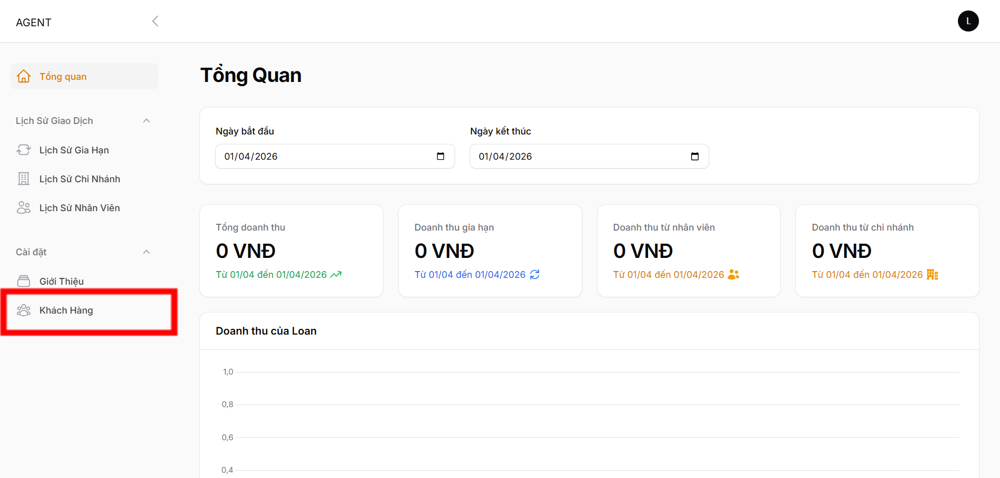
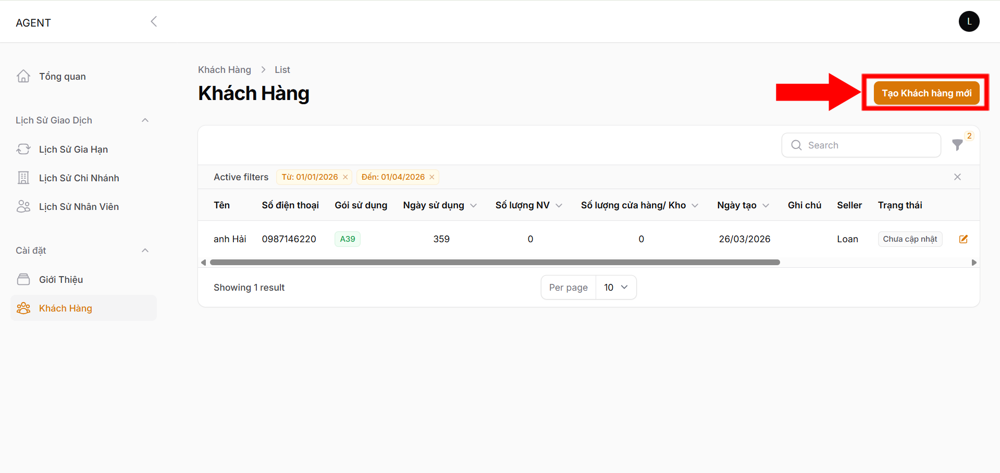
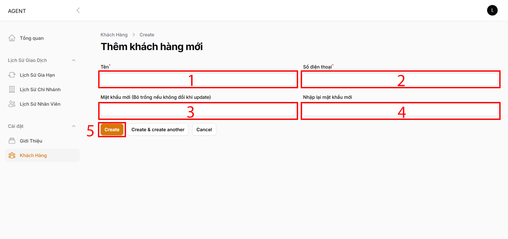
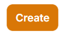

# Thêm khách hàng

**Bước 1:** Tại màn hình chính, chọn để chuyển sang màn hình Khách hàng:

<figure><figcaption></figcaption></figure>

**Bước 2:** Nhấn chọn để tới màn hình thêm khách hàng mới:

<figure><figcaption></figcaption></figure>

**Bước 3:** Sau khi đã vào được màn hình Thêm khách hàng mới, điền đầy đủ thông tin khách hàng mới (tên, số điện thoại và mật khẩu):

<figure><figcaption></figcaption></figure>

Sau khi điền xong thông tin, nhấn  để tạo khách hàng mới.

